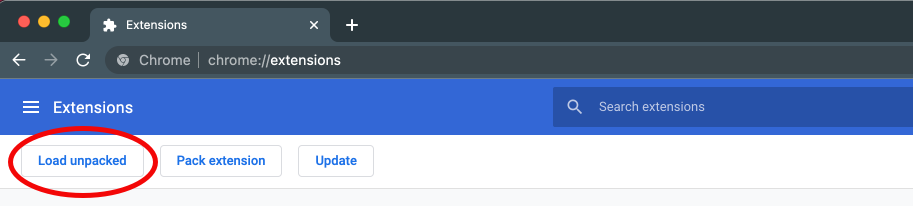

# Chrome Extension V3 Boilerplate


Chrome Extension, TypeScript and Visual Studio Code

## Built With

- 
- 
- 
- 
- 
- 
- 

In addition we use:

- [Tailwind Prettier Plugin](https://github.com/tailwindlabs/prettier-plugin-tailwindcss)
  The Tailwind Prettier Plugin automatically sorts tailwind classes. No need to use a VS Code Extension for that purpose anymore.
- [MV3 Hot Reload](https://github.com/pacexy/mv3-hot-reload)
  MV3 Hot Reload watches file changes and sends a reload message to your extension under development in case of a file change.
- [Husky](https://github.com/typicode/husky)
  Husky offers an elegant way to manage git hooks.
- [Commitlint](https://github.com/conventional-changelog/commitlint)
  Commitlint enforces commit messages to follow a certain format. You can find the rules in `commitlint.config.js`.
- [Dot Env Webpack](https://github.com/kerimdzhanov/dotenv-flow-webpack)
  Dot Env Webpack gives the ability to access environment variables defined in your `.env`, `.env.development` etc. via 'process.env'. from files within your web application.

## Setup

yarn
yarn run prepare
yarn run dev:scripts

### Install Extension in Chrome

1. Go to `chrome://extensions/` in your Chrome Browser.
2. Click on `Load unpacked`
3. Select the `dist` folder of the repo



## Project Structure

- src/background
  Files for the background service worker
- src/content
  Files for the contect script which has access to the page's DOM.
- src/options
  Files for the options page.
- src/popup
  Files for the popup widget which appear when the user clicks on the extension icon in the browser bar.
- dist/manifest.json
  Config/Manifest file of the extension (permissions, icons, etc.)
- dist/images
  Folder for images and icons used in the extension.

## Development mode

After you have setup the project you only need to run `yarn run dev:scripts` to keep working on your extension.

## Build for production

Simply run `yarn run build` to obtain an optimized production build. Afterwards, zip the dist folder and upload it to the Chrome Extension Store.

## Commit Message Rules

A commit message has the following format: `<type>: message`.  
Possible types:

```
feat
fix
docs
chore
style
refactor
ci
test
perf
revert
```

Example: `chore: update eslint package`
